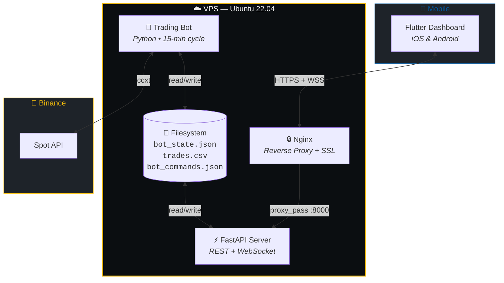
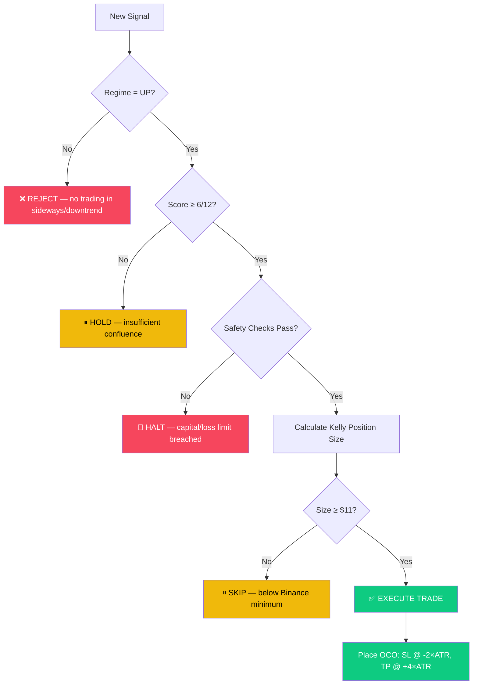

<p align="center">
  
</p>

<h1 align="center">⚡ Trade Bot</h1>

<p align="center">
  <b>Institutional-Grade Automated Bitcoin Trading System</b><br/>
  <sub>Multi-Timeframe Analysis • Kelly Criterion Risk Engine • Real-Time Mobile Dashboard</sub>
</p>

<p align="center">
  <a href="#-quick-start"></a>
  <a href="#-architecture"></a>
  <a href="#-api-reference"></a>
</p>

<p align="center">
  
  
  
  
  
  
</p>

---

## 📋 Table of Contents

- [Overview](#-overview)
- [Key Features](#-key-features)
- [Architecture](#-architecture)
- [Trading Strategy](#-trading-strategy)
- [Tech Stack](#-tech-stack)
- [Project Structure](#-project-structure)
- [Quick Start](#-quick-start)
- [Configuration](#-configuration)
- [API Reference](#-api-reference)
- [Mobile App](#-mobile-app)
- [Risk Management](#-risk-management)
- [Deployment](#-deployment)
- [Contributing](#-contributing)
- [Disclaimer](#%EF%B8%8F-disclaimer)
- [License](#-license)

---

## 🌟 Overview

**Trade Bot** is a professional, production-ready Bitcoin trading system that combines quantitative analysis with real-time mobile monitoring. Built with a modular architecture, it runs autonomously on a VPS while providing full remote control through a beautifully designed Flutter mobile dashboard.

The system analyzes BTC/USDT across **three timeframes** (1h, 4h, 1d), detects market regimes, generates confluence-based signals, and executes trades with mathematically optimized position sizing using the **Kelly Criterion**.

<table>
<tr>
<td width="50%">

### 🎯 What It Does
- Monitors BTC/USDT 24/7 on Binance
- Detects trending vs. sideways markets
- Generates buy signals when 6+ of 12 confluence factors align
- Auto-executes trades with ATR-based SL/TP
- Sizes positions using Half-Kelly for optimal growth
- Streams everything to your phone in real-time

</td>
<td width="50%">

### 🛡️ What Makes It Safe
- Never trades in sideways markets
- Dynamic stop-loss at 2×ATR below entry
- Take-profit at 4×ATR (1:2 risk-reward)
- 5% daily loss circuit breaker
- $50 minimum capital protection
- OCO orders protect every position on-exchange

</td>
</tr>
</table>

---

## ✨ Key Features

<table>
<tr>
<td align="center" width="25%">
<br/>
<b>Multi-Timeframe Analysis</b><br/>
<sub>1H • 4H • 1D candles with RSI, Bollinger Bands, EMA crossovers, ATR & volume analysis</sub>
</td>
<td align="center" width="25%">
<br/>
<b>Regime Detection</b><br/>
<sub>AI-style market classification: Trending Up, Trending Down, Sideways — using EMA50/EMA200 alignment</sub>
</td>
<td align="center" width="25%">
<br/>
<b>Kelly Criterion</b><br/>
<sub>Half-Kelly position sizing with live recalibration every 10 trades from actual win rate and R/R ratio</sub>
</td>
<td align="center" width="25%">
<br/>
<b>Mobile Dashboard</b><br/>
<sub>Real-time Flutter app with WebSocket streaming, quick controls, and Binance-dark aesthetics</sub>
</td>
</tr>
<tr>
<td align="center" width="25%">
<br/>
<b>JWT Authentication</b><br/>
<sub>Bcrypt-hashed passwords, Bearer token auth with configurable expiry, protected API routes</sub>
</td>
<td align="center" width="25%">
<br/>
<b>Rate Limiting</b><br/>
<sub>SlowAPI-powered request throttling to prevent abuse and stay within exchange API limits</sub>
</td>
<td align="center" width="25%">
<br/>
<b>Trade Logging</b><br/>
<sub>Every trade recorded to CSV with entry/exit prices, PnL, hold time, RSI values, and regime data</sub>
</td>
<td align="center" width="25%">
<br/>
<b>Auto-Recovery</b><br/>
<sub>Exponential backoff retries, graceful shutdown preserving positions, and API error circuit breakers</sub>
</td>
</tr>
</table>

---

## 🏗 Architecture

The system uses a **Bridge Architecture** — the trading bot and the API server communicate through the filesystem, ensuring the bot remains isolated and stable while providing real-time data to the mobile interface.



---

## 📈 Trading Strategy

### Signal Generation Pipeline

```
 ┌──────────────┐     ┌──────────────┐     ┌──────────────┐     ┌──────────────┐
 │  OHLCV Data  │────▶│  Indicators  │────▶│   Regime     │────▶│   Signal     │
 │  1h • 4h • 1d│     │  RSI BB EMA  │     │  Detection   │     │  Scoring     │
 │  200 candles  │     │  ATR Volume  │     │  UP/DOWN/SIDE│     │  0-12 score  │
 └──────────────┘     └──────────────┘     └──────────────┘     └──────────────┘
                                                                       │
                                                               ┌───────┴───────┐
                                                               │  score ≥ 6?   │
                                                               │  regime = UP? │
                                                               └───┬───────┬───┘
                                                              YES  │       │  NO
                                                            ┌──────┘       └──────┐
                                                            ▼                     ▼
                                                       🟢 BUY               ⏸ HOLD
```

### Confluence Scoring (per timeframe, max 4 points each)

| Factor | Condition | Points |
|--------|-----------|:------:|
| **RSI Oversold** | RSI < 40 | +1 |
| **Bollinger Band** | Price within 1.5% of lower band | +1 |
| **RSI Divergence** | Bullish divergence (5-candle lookback) | +1 |
| **Volume Surge** | Current volume > 1.3× 20-period average | +1 |

> **Total: 12 points** (4 per timeframe × 3 timeframes). A **BUY** requires ≥ 6/12 in a confirmed uptrend.

### Exit Conditions (any one triggers a SELL)

| Condition | Logic |
|-----------|-------|
| 🔴 **Stop-Loss** | Price ≤ Entry − 2×ATR |
| 🟢 **Take-Profit** | Price ≥ Entry + 4×ATR |
| 📊 **RSI Overbought** | RSI > 65 on both 1h AND 4h |
| 📉 **Bearish Divergence** | RSI divergence detected on 4h |
| 🔄 **Regime Shift** | Market turns Sideways or Down |

---

## 🛠 Tech Stack

<table>
<tr>
<th width="50%">Backend</th>
<th width="50%">Mobile App</th>
</tr>
<tr>
<td>

| Technology | Purpose |
|------------|---------|
| **Python 3.10+** | Core runtime |
| **ccxt** | Binance API wrapper |
| **pandas + numpy** | Data analysis |
| **ta** | Technical indicators |
| **FastAPI** | Async REST API |
| **WebSocket** | Real-time streaming |
| **JWT (python-jose)** | Authentication |
| **bcrypt** | Password hashing |
| **SlowAPI** | Rate limiting |
| **schedule** | Cron-like task runner |
| **Nginx** | Reverse proxy + SSL |

</td>
<td>

| Technology | Purpose |
|------------|---------|
| **Flutter 3.x** | Cross-platform UI |
| **Dart** | Application logic |
| **WebSocket Channel** | Live data streaming |
| **Secure Storage** | Encrypted JWT tokens |
| **Material Design** | Binance-dark theme |
| **Pull-to-Refresh** | Manual data sync |

### 📱 App Screens
- `Dashboard` — Live prices, PnL, regime, RSI gauges
- `Bot Control` — Start / Stop / Restart remotely
- `Live Signals` — Real-time signal scores
- `Trade History` — Full trade log with analytics
- `Settings` — API connection & preferences
- `Login` — Secure JWT authentication

</td>
</tr>
</table>

---

## 📁 Project Structure

```
trade-bot/
│
├── 📄 main.py                    # Entry point — python main.py
├── 📄 requirements.txt           # Bot dependencies
├── 📄 requirements_api.txt       # API server dependencies
├── 📄 nginx.conf                 # Nginx reverse proxy config
├── 📄 .env.example               # Environment variable template
│
├── 🐍 backend/                   # Python trading engine + API
│   ├── __init__.py
│   ├── config.py                 # Exchange connection & parameters
│   ├── data.py                   # Multi-timeframe OHLCV fetching
│   ├── indicators.py             # RSI, BB, EMA, ATR, Volume, Divergence
│   ├── strategy.py               # Regime detection & signal scoring
│   ├── risk.py                   # Kelly Criterion & safety checks
│   ├── executor.py               # Order execution (real + paper)
│   ├── logger.py                 # Console dashboard & CSV logging
│   ├── main.py                   # Trading loop (15-min cycles)
│   │
│   └── api/                      # FastAPI REST + WebSocket server
│       ├── main.py               # App factory & route registration
│       ├── auth.py               # JWT login & token validation
│       ├── models.py             # Pydantic request/response models
│       ├── websocket.py          # Real-time data streaming
│       └── routes/
│           ├── status.py         # GET /api/status
│           ├── portfolio.py      # GET /api/portfolio
│           ├── trades.py         # GET /api/trades
│           ├── signals.py        # GET /api/signals
│           ├── control.py        # POST /api/control/{action}
│           └── settings.py       # GET/PUT /api/settings
│
└── 📱 mobile_app/                # Flutter mobile dashboard
    ├── pubspec.yaml
    ├── lib/
    │   ├── main.dart
    │   ├── app_theme.dart        # Binance-dark color system
    │   ├── api_config.dart       # Server URL configuration
    │   ├── services/
    │   │   └── api_service.dart   # HTTP + auth helper
    │   ├── screens/
    │   │   ├── login_screen.dart
    │   │   ├── dashboard_screen.dart
    │   │   ├── bot_control_screen.dart
    │   │   ├── live_signals_screen.dart
    │   │   ├── trade_history_screen.dart
    │   │   └── settings_screen.dart
    │   └── custom_drawer/
    │       ├── home_drawer.dart
    │       └── drawer_user_controller.dart
    ├── android/
    └── ios/
```

---

## 🚀 Quick Start

### Prerequisites

| Requirement | Version |
|-------------|---------|
| Python | 3.10+ |
| Flutter | 3.x |
| Binance Account | Testnet or Live |
| VPS (optional) | Ubuntu 22.04 recommended |

### 1️⃣ Clone & Install

```bash
git clone https://github.com/orkhankasumov4-netizen/trade-bot.git
cd trade-bot

# Create virtual environment
python3 -m venv venv
source venv/bin/activate  # Linux/Mac
# venv\Scripts\activate   # Windows

# Install dependencies
pip install -r requirements.txt
pip install -r requirements_api.txt
```

### 2️⃣ Configure Environment

```bash
cp .env.example .env
```

Edit `.env` with your credentials:

```env
# ── Binance Credentials ─────────────────────────────────
MODE=testnet                          # testnet | live

BINANCE_TESTNET_API_KEY=your_testnet_key
BINANCE_TESTNET_API_SECRET=your_testnet_secret

BINANCE_API_KEY=your_live_key         # Only for MODE=live
BINANCE_API_SECRET=your_live_secret   # Only for MODE=live

# ── API Authentication ───────────────────────────────────
API_USERNAME=admin
API_PASSWORD=your_secure_password
JWT_SECRET=your_random_64_char_hex_string
JWT_EXPIRE_HOURS=24
```

### 3️⃣ Run the Trading Bot

```bash
# Testnet (paper trade) — safe for testing
python main.py

# Testnet with explicit flag
python main.py --mode testnet --paper

# ⚠️ Live mode — REAL MONEY
python main.py --mode live
```

### 4️⃣ Run the API Server

```bash
# In a separate terminal
cd backend/api
uvicorn main:app --host 0.0.0.0 --port 8000 --reload
```

### 5️⃣ Launch Mobile App

```bash
cd mobile_app

# Update API URL in lib/api_config.dart
# Point to your VPS IP or localhost

flutter pub get
flutter run
```

---

## ⚙️ Configuration

### Trading Parameters

| Parameter | Default | Description |
|-----------|:-------:|-------------|
| `SYMBOL` | BTC/USDT | Trading pair |
| `TIMEFRAMES` | 1h, 4h, 1d | Analysis timeframes |
| `CANDLE_LIMIT` | 200 | Candles per timeframe |
| `REFRESH_INTERVAL_MIN` | 15 | Cycle interval (minutes) |
| `MAX_POSITION_FRACTION` | 20% | Max position vs. balance |
| `MIN_POSITION_USDT` | $11 | Binance minimum order |
| `MAX_OPEN_POSITIONS` | 1 | Concurrent positions |
| `DAILY_LOSS_FRACTION` | 5% | Daily loss circuit breaker |
| `MIN_CAPITAL_USDT` | $50 | Minimum balance to trade |
| `BOOTSTRAP_WIN_RATE` | 50% | Assumed WR for first 20 trades |
| `BOOTSTRAP_REWARD_RISK` | 2.0 | Assumed R/R for first 20 trades |

---

## 📖 API Reference

### Authentication

```http
POST /api/auth/login
Content-Type: application/json

{
  "username": "admin",
  "password": "your_password"
}

# Response: { "access_token": "eyJ...", "token_type": "bearer", "expires_in": 86400 }
```

### Endpoints

All routes below require `Authorization: Bearer <token>` header.

| Method | Endpoint | Description |
|:------:|----------|-------------|
| `GET` | `/api/health` | Health check (public) |
| `GET` | `/api/status` | Bot status, price, regime, signal score |
| `GET` | `/api/portfolio` | Portfolio value, PnL, open positions |
| `GET` | `/api/trades` | Trade history with analytics |
| `GET` | `/api/signals` | Current signal details |
| `POST` | `/api/control/start` | Start the trading bot |
| `POST` | `/api/control/stop` | Stop the trading bot |
| `POST` | `/api/control/restart` | Restart the trading bot |
| `GET` | `/api/settings` | Current bot settings |
| `PUT` | `/api/settings` | Update bot settings |
| `WS` | `/ws/live` | Real-time WebSocket stream |

---

## 📱 Mobile App

The Flutter dashboard uses a **Binance-inspired dark theme** with real-time data streaming.

### Theme Palette

| Color | Hex | Usage |
|-------|-----|-------|
| 🖤 Background | `#0B0E11` | Main background |
| ⬛ Card | `#1E2329` | Card surfaces |
| 🟡 Accent | `#F0B90B` | Primary actions, highlights |
| 🟢 Profit | `#0ECB81` | Positive PnL, uptrend |
| 🔴 Loss | `#F6465D` | Negative PnL, downtrend |

### Dashboard Components

- **Quick Controls** — Start/Stop bot with one tap
- **Bot Status** — Running state with last update time
- **BTC Price** — Live price with 24h change percentage
- **Portfolio** — Total value, PnL, open position PnL
- **Market Regime** — Visual regime indicator (UP ▲ / DOWN ▼ / SIDE -)
- **Signal Score** — Progress bar showing 0-12 confluence score
- **RSI Gauges** — Color-coded RSI across all timeframes

---

## 🛡 Risk Management

The bot employs a **defense-in-depth** approach to risk management:



### Safety Layers

| Layer | Protection | Action |
|:-----:|------------|--------|
| 1 | Regime Filter | Only trades in confirmed uptrends |
| 2 | Score Threshold | Requires ≥ 6/12 confluence score |
| 3 | Capital Check | Halts below $50 USDT balance |
| 4 | Daily Loss Limit | Stops after 5% daily drawdown |
| 5 | Position Sizing | Half-Kelly caps at 20% of balance |
| 6 | Stop-Loss | Dynamic ATR-based SL on exchange |
| 7 | Take-Profit | ATR-based TP with 1:2 risk-reward |
| 8 | API Errors | Halts after 3 consecutive failures |

### Performance Metrics

The bot tracks and displays these metrics in real-time:

- **Win Rate** — Rolling win percentage (last 20 trades)
- **Kelly Fraction** — Current optimal bet size
- **Sharpe Ratio** — Annualized risk-adjusted return
- **Max Drawdown** — Deepest equity decline
- **Average Hold Time** — Mean position duration

---

## 🌍 Deployment

### VPS Deployment (Recommended)

```bash
# 1. SSH into your VPS
ssh user@your-vps-ip

# 2. Clone and setup
git clone https://github.com/orkhankasumov4-netizen/trade-bot.git
cd trade-bot
python3 -m venv venv && source venv/bin/activate
pip install -r requirements.txt -r requirements_api.txt

# 3. Configure
cp .env.example .env
nano .env  # Add your credentials

# 4. Run bot in background
screen -dmS bot python main.py

# 5. Run API in background
screen -dmS api bash -c "cd backend/api && uvicorn main:app --host 0.0.0.0 --port 8000"

# 6. Setup Nginx (optional but recommended)
sudo cp nginx.conf /etc/nginx/sites-available/trade-bot
sudo ln -s /etc/nginx/sites-available/trade-bot /etc/nginx/sites-enabled/
sudo nginx -t && sudo systemctl reload nginx
```

### Console Dashboard Preview

When the bot is running, you'll see this output every 15 minutes:

```
══════════════════════════════════════════════════════════════════════
  [2026-04-17 02:00]  BTC/USDT: $96,421.50  |  Regime: TRENDING UP
  1h: RSI=38.2 BB=Lower  |  4h: RSI=42.1 BB=Mid  |  1d: RSI=55.3 BB=Mid
  📈 Signal Score: 7/12 → BUY TRIGGERED
  Position: 0.01024 BTC | Entry: $96,421.50 | SL: $95,200.00 | TP: $98,865.50
  Open PnL: +$12.40
  Portfolio: $1,000.00 → $1,012.40 | Return: +1.24%
──────────────────────────────────────────────────────────────────────
  Win Rate: 62.5% (last 20) | Kelly: 0.1250 | Sharpe: 1.87
  Max DD: 3.21% | Avg Hold: 4.2h | Trades: 47
  Today PnL: +$24.60 / Limit: -$50.00
══════════════════════════════════════════════════════════════════════
```

---

## 🤝 Contributing

Contributions are welcome! Here's how to get started:

1. **Fork** the repository
2. Create a feature branch: `git checkout -b feature/amazing-feature`
3. Commit changes: `git commit -m 'Add amazing feature'`
4. Push to branch: `git push origin feature/amazing-feature`
5. Open a **Pull Request**

### Development Guidelines

- Follow PEP 8 for Python code
- Use type hints in all function signatures
- Write docstrings for all public functions
- Keep the modular architecture — each file has a single responsibility

---

## ⚠️ Disclaimer

> **Trading cryptocurrencies involves significant risk of financial loss.** This software is provided "as is" for educational and informational purposes only. Past performance does not guarantee future results. The authors are not financial advisors. Always do your own research (DYOR) and never invest more than you can afford to lose. Use testnet mode to understand the system before risking real capital.

---

## 📄 License

This project is licensed under the **MIT License** — see the [LICENSE](LICENSE) file for details.

---

<p align="center">
  <sub>Built with ❤️ and ☕ by <a href="https://github.com/orkhankasumov4-netizen">Orkhan Kasumov</a></sub><br/>
  <sub>⭐ Star this repo if you find it useful!</sub>
</p>
